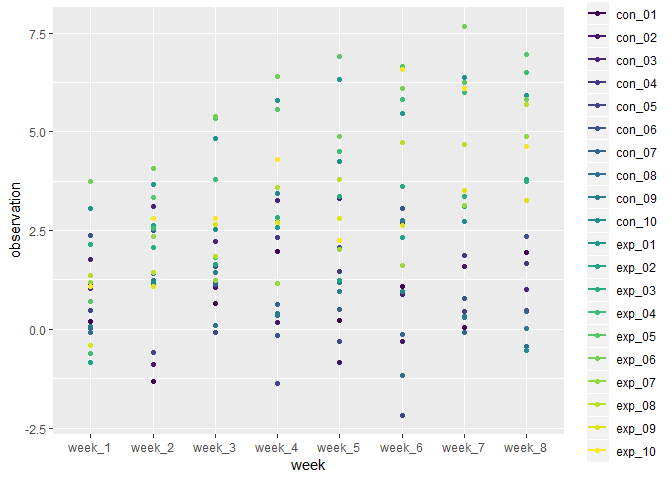

Untitled
================

Problem 1
=========

``` r
library(tidyverse)
```

    ## -- Attaching packages -------------------------------------------------------------------------------- tidyverse 1.2.1 --

    ## v ggplot2 3.0.0     v purrr   0.2.5
    ## v tibble  1.4.2     v dplyr   0.7.6
    ## v tidyr   0.8.1     v stringr 1.3.1
    ## v readr   1.1.1     v forcats 0.3.0

    ## -- Conflicts ----------------------------------------------------------------------------------- tidyverse_conflicts() --
    ## x dplyr::filter() masks stats::filter()
    ## x dplyr::lag()    masks stats::lag()

``` r
filename=list.files("C:/Users/lenovo/Desktop/p8105/data_import_examples",pattern="^con|^exp")
allname=tibble(filename)
allname
```

    ## # A tibble: 20 x 1
    ##    filename  
    ##    <chr>     
    ##  1 con_01.csv
    ##  2 con_02.csv
    ##  3 con_03.csv
    ##  4 con_04.csv
    ##  5 con_05.csv
    ##  6 con_06.csv
    ##  7 con_07.csv
    ##  8 con_08.csv
    ##  9 con_09.csv
    ## 10 con_10.csv
    ## 11 exp_01.csv
    ## 12 exp_02.csv
    ## 13 exp_03.csv
    ## 14 exp_04.csv
    ## 15 exp_05.csv
    ## 16 exp_06.csv
    ## 17 exp_07.csv
    ## 18 exp_08.csv
    ## 19 exp_09.csv
    ## 20 exp_10.csv

``` r
readdata=function(path){
  read_csv(file=path)
}

allpath=c("C:/Users/lenovo/Desktop/p8105/data_import_examples/con_01.csv","C:/Users/lenovo/Desktop/p8105/data_import_examples/con_02.csv","C:/Users/lenovo/Desktop/p8105/data_import_examples/con_03.csv","C:/Users/lenovo/Desktop/p8105/data_import_examples/con_04.csv","C:/Users/lenovo/Desktop/p8105/data_import_examples/con_05.csv","C:/Users/lenovo/Desktop/p8105/data_import_examples/con_06.csv","C:/Users/lenovo/Desktop/p8105/data_import_examples/con_07.csv","C:/Users/lenovo/Desktop/p8105/data_import_examples/con_08.csv","C:/Users/lenovo/Desktop/p8105/data_import_examples/con_09.csv","C:/Users/lenovo/Desktop/p8105/data_import_examples/con_10.csv","C:/Users/lenovo/Desktop/p8105/data_import_examples/exp_01.csv","C:/Users/lenovo/Desktop/p8105/data_import_examples/exp_02.csv","C:/Users/lenovo/Desktop/p8105/data_import_examples/exp_03.csv","C:/Users/lenovo/Desktop/p8105/data_import_examples/exp_04.csv","C:/Users/lenovo/Desktop/p8105/data_import_examples/exp_05.csv","C:/Users/lenovo/Desktop/p8105/data_import_examples/exp_06.csv","C:/Users/lenovo/Desktop/p8105/data_import_examples/exp_07.csv","C:/Users/lenovo/Desktop/p8105/data_import_examples/exp_08.csv","C:/Users/lenovo/Desktop/p8105/data_import_examples/exp_09.csv","C:/Users/lenovo/Desktop/p8105/data_import_examples/exp_10.csv")
alldata=map(allpath,readdata)
```

    ## Parsed with column specification:
    ## cols(
    ##   week_1 = col_double(),
    ##   week_2 = col_double(),
    ##   week_3 = col_double(),
    ##   week_4 = col_double(),
    ##   week_5 = col_double(),
    ##   week_6 = col_double(),
    ##   week_7 = col_double(),
    ##   week_8 = col_double()
    ## )

    ## Parsed with column specification:
    ## cols(
    ##   week_1 = col_double(),
    ##   week_2 = col_double(),
    ##   week_3 = col_double(),
    ##   week_4 = col_double(),
    ##   week_5 = col_double(),
    ##   week_6 = col_double(),
    ##   week_7 = col_double(),
    ##   week_8 = col_double()
    ## )
    ## Parsed with column specification:
    ## cols(
    ##   week_1 = col_double(),
    ##   week_2 = col_double(),
    ##   week_3 = col_double(),
    ##   week_4 = col_double(),
    ##   week_5 = col_double(),
    ##   week_6 = col_double(),
    ##   week_7 = col_double(),
    ##   week_8 = col_double()
    ## )
    ## Parsed with column specification:
    ## cols(
    ##   week_1 = col_double(),
    ##   week_2 = col_double(),
    ##   week_3 = col_double(),
    ##   week_4 = col_double(),
    ##   week_5 = col_double(),
    ##   week_6 = col_double(),
    ##   week_7 = col_double(),
    ##   week_8 = col_double()
    ## )
    ## Parsed with column specification:
    ## cols(
    ##   week_1 = col_double(),
    ##   week_2 = col_double(),
    ##   week_3 = col_double(),
    ##   week_4 = col_double(),
    ##   week_5 = col_double(),
    ##   week_6 = col_double(),
    ##   week_7 = col_double(),
    ##   week_8 = col_double()
    ## )
    ## Parsed with column specification:
    ## cols(
    ##   week_1 = col_double(),
    ##   week_2 = col_double(),
    ##   week_3 = col_double(),
    ##   week_4 = col_double(),
    ##   week_5 = col_double(),
    ##   week_6 = col_double(),
    ##   week_7 = col_double(),
    ##   week_8 = col_double()
    ## )
    ## Parsed with column specification:
    ## cols(
    ##   week_1 = col_double(),
    ##   week_2 = col_double(),
    ##   week_3 = col_double(),
    ##   week_4 = col_double(),
    ##   week_5 = col_double(),
    ##   week_6 = col_double(),
    ##   week_7 = col_double(),
    ##   week_8 = col_double()
    ## )
    ## Parsed with column specification:
    ## cols(
    ##   week_1 = col_double(),
    ##   week_2 = col_double(),
    ##   week_3 = col_double(),
    ##   week_4 = col_double(),
    ##   week_5 = col_double(),
    ##   week_6 = col_double(),
    ##   week_7 = col_double(),
    ##   week_8 = col_double()
    ## )
    ## Parsed with column specification:
    ## cols(
    ##   week_1 = col_double(),
    ##   week_2 = col_double(),
    ##   week_3 = col_double(),
    ##   week_4 = col_double(),
    ##   week_5 = col_double(),
    ##   week_6 = col_double(),
    ##   week_7 = col_double(),
    ##   week_8 = col_double()
    ## )
    ## Parsed with column specification:
    ## cols(
    ##   week_1 = col_double(),
    ##   week_2 = col_double(),
    ##   week_3 = col_double(),
    ##   week_4 = col_double(),
    ##   week_5 = col_double(),
    ##   week_6 = col_double(),
    ##   week_7 = col_double(),
    ##   week_8 = col_double()
    ## )
    ## Parsed with column specification:
    ## cols(
    ##   week_1 = col_double(),
    ##   week_2 = col_double(),
    ##   week_3 = col_double(),
    ##   week_4 = col_double(),
    ##   week_5 = col_double(),
    ##   week_6 = col_double(),
    ##   week_7 = col_double(),
    ##   week_8 = col_double()
    ## )
    ## Parsed with column specification:
    ## cols(
    ##   week_1 = col_double(),
    ##   week_2 = col_double(),
    ##   week_3 = col_double(),
    ##   week_4 = col_double(),
    ##   week_5 = col_double(),
    ##   week_6 = col_double(),
    ##   week_7 = col_double(),
    ##   week_8 = col_double()
    ## )
    ## Parsed with column specification:
    ## cols(
    ##   week_1 = col_double(),
    ##   week_2 = col_double(),
    ##   week_3 = col_double(),
    ##   week_4 = col_double(),
    ##   week_5 = col_double(),
    ##   week_6 = col_double(),
    ##   week_7 = col_double(),
    ##   week_8 = col_double()
    ## )

    ## Parsed with column specification:
    ## cols(
    ##   week_1 = col_double(),
    ##   week_2 = col_double(),
    ##   week_3 = col_double(),
    ##   week_4 = col_double(),
    ##   week_5 = col_double(),
    ##   week_6 = col_double(),
    ##   week_7 = col_integer(),
    ##   week_8 = col_double()
    ## )

    ## Parsed with column specification:
    ## cols(
    ##   week_1 = col_double(),
    ##   week_2 = col_double(),
    ##   week_3 = col_double(),
    ##   week_4 = col_double(),
    ##   week_5 = col_double(),
    ##   week_6 = col_double(),
    ##   week_7 = col_double(),
    ##   week_8 = col_double()
    ## )
    ## Parsed with column specification:
    ## cols(
    ##   week_1 = col_double(),
    ##   week_2 = col_double(),
    ##   week_3 = col_double(),
    ##   week_4 = col_double(),
    ##   week_5 = col_double(),
    ##   week_6 = col_double(),
    ##   week_7 = col_double(),
    ##   week_8 = col_double()
    ## )
    ## Parsed with column specification:
    ## cols(
    ##   week_1 = col_double(),
    ##   week_2 = col_double(),
    ##   week_3 = col_double(),
    ##   week_4 = col_double(),
    ##   week_5 = col_double(),
    ##   week_6 = col_double(),
    ##   week_7 = col_double(),
    ##   week_8 = col_double()
    ## )
    ## Parsed with column specification:
    ## cols(
    ##   week_1 = col_double(),
    ##   week_2 = col_double(),
    ##   week_3 = col_double(),
    ##   week_4 = col_double(),
    ##   week_5 = col_double(),
    ##   week_6 = col_double(),
    ##   week_7 = col_double(),
    ##   week_8 = col_double()
    ## )
    ## Parsed with column specification:
    ## cols(
    ##   week_1 = col_double(),
    ##   week_2 = col_double(),
    ##   week_3 = col_double(),
    ##   week_4 = col_double(),
    ##   week_5 = col_double(),
    ##   week_6 = col_double(),
    ##   week_7 = col_double(),
    ##   week_8 = col_double()
    ## )
    ## Parsed with column specification:
    ## cols(
    ##   week_1 = col_double(),
    ##   week_2 = col_double(),
    ##   week_3 = col_double(),
    ##   week_4 = col_double(),
    ##   week_5 = col_double(),
    ##   week_6 = col_double(),
    ##   week_7 = col_double(),
    ##   week_8 = col_double()
    ## )

``` r
newdata=allname%>%
  mutate(alldata)%>%
  unnest(alldata)%>%
  separate(filename,into=c("subject","csv"),sep=6)%>%
  select(-csv)
 
newdata
```

    ## # A tibble: 20 x 9
    ##    subject week_1 week_2 week_3 week_4 week_5 week_6 week_7 week_8
    ##    <chr>    <dbl>  <dbl>  <dbl>  <dbl>  <dbl>  <dbl>  <dbl>  <dbl>
    ##  1 con_01    0.2  -1.31    0.66   1.96   0.23   1.09   0.05   1.94
    ##  2 con_02    1.13 -0.88    1.07   0.17  -0.83  -0.31   1.58   0.44
    ##  3 con_03    1.77  3.11    2.22   3.26   3.31   0.89   1.88   1.01
    ##  4 con_04    1.04  3.66    1.22   2.33   1.47   2.7    1.87   1.66
    ##  5 con_05    0.47 -0.580  -0.09  -1.37  -0.32  -2.17   0.45   0.48
    ##  6 con_06    2.37  2.5     1.59  -0.16   2.08   3.07   0.78   2.35
    ##  7 con_07    0.03  1.21    1.13   0.64   0.49  -0.12  -0.07   0.46
    ##  8 con_08   -0.08  1.42    0.09   0.36   1.18  -1.16   0.33  -0.44
    ##  9 con_09    0.08  1.24    1.44   0.41   0.95   2.75   0.3    0.03
    ## 10 con_10    2.14  1.15    2.52   3.44   4.26   0.97   2.73  -0.53
    ## 11 exp_01    3.05  3.67    4.84   5.8    6.33   5.46   6.38   5.91
    ## 12 exp_02   -0.84  2.63    1.64   2.58   1.24   2.32   3.11   3.78
    ## 13 exp_03    2.15  2.08    1.82   2.84   3.36   3.61   3.37   3.74
    ## 14 exp_04   -0.62  2.54    3.78   2.73   4.49   5.82   6      6.49
    ## 15 exp_05    0.7   3.33    5.34   5.57   6.9    6.66   6.24   6.95
    ## 16 exp_06    3.73  4.08    5.4    6.41   4.87   6.09   7.66   5.83
    ## 17 exp_07    1.18  2.35    1.23   1.17   2.02   1.61   3.13   4.88
    ## 18 exp_08    1.37  1.43    1.84   3.6    3.8    4.72   4.68   5.7 
    ## 19 exp_09   -0.4   1.08    2.66   2.7    2.8    2.64   3.51   3.27
    ## 20 exp_10    1.09  2.8     2.8    4.3    2.25   6.57   6.09   4.64

``` r
newdata=newdata%>%
  gather(key=week,value=observation,week_1:week_8)
newdata
```

    ## # A tibble: 160 x 3
    ##    subject week   observation
    ##    <chr>   <chr>        <dbl>
    ##  1 con_01  week_1        0.2 
    ##  2 con_02  week_1        1.13
    ##  3 con_03  week_1        1.77
    ##  4 con_04  week_1        1.04
    ##  5 con_05  week_1        0.47
    ##  6 con_06  week_1        2.37
    ##  7 con_07  week_1        0.03
    ##  8 con_08  week_1       -0.08
    ##  9 con_09  week_1        0.08
    ## 10 con_10  week_1        2.14
    ## # ... with 150 more rows

``` r
ggplot(newdata,aes(x = week, y = observation, color = subject)) + 
  geom_point()+
  geom_smooth(se = FALSE) +
  viridis::scale_color_viridis(
    name = "day", 
    discrete = TRUE
  )
```

    ## `geom_smooth()` using method = 'loess' and formula 'y ~ x'



-   From the ploy, we can find the observations in exp group is obviously higher than observations in control group.

Problme 2
=========

``` r
library(tidyverse)

data=read_csv(file="C:/Users/lenovo/Desktop/p8105/data_import_examples/homicide-data.csv")
```

    ## Parsed with column specification:
    ## cols(
    ##   uid = col_character(),
    ##   reported_date = col_integer(),
    ##   victim_last = col_character(),
    ##   victim_first = col_character(),
    ##   victim_race = col_character(),
    ##   victim_age = col_character(),
    ##   victim_sex = col_character(),
    ##   city = col_character(),
    ##   state = col_character(),
    ##   lat = col_double(),
    ##   lon = col_double(),
    ##   disposition = col_character()
    ## )

``` r
data
```

    ## # A tibble: 52,179 x 12
    ##    uid   reported_date victim_last victim_first victim_race victim_age
    ##    <chr>         <int> <chr>       <chr>        <chr>       <chr>     
    ##  1 Alb-~      20100504 GARCIA      JUAN         Hispanic    78        
    ##  2 Alb-~      20100216 MONTOYA     CAMERON      Hispanic    17        
    ##  3 Alb-~      20100601 SATTERFIELD VIVIANA      White       15        
    ##  4 Alb-~      20100101 MENDIOLA    CARLOS       Hispanic    32        
    ##  5 Alb-~      20100102 MULA        VIVIAN       White       72        
    ##  6 Alb-~      20100126 BOOK        GERALDINE    White       91        
    ##  7 Alb-~      20100127 MALDONADO   DAVID        Hispanic    52        
    ##  8 Alb-~      20100127 MALDONADO   CONNIE       Hispanic    52        
    ##  9 Alb-~      20100130 MARTIN-LEY~ GUSTAVO      White       56        
    ## 10 Alb-~      20100210 HERRERA     ISRAEL       Hispanic    43        
    ## # ... with 52,169 more rows, and 6 more variables: victim_sex <chr>,
    ## #   city <chr>, state <chr>, lat <dbl>, lon <dbl>, disposition <chr>

``` r
data=data%>%
  unite("city_state",c("city","state"))
data
```

    ## # A tibble: 52,179 x 11
    ##    uid   reported_date victim_last victim_first victim_race victim_age
    ##    <chr>         <int> <chr>       <chr>        <chr>       <chr>     
    ##  1 Alb-~      20100504 GARCIA      JUAN         Hispanic    78        
    ##  2 Alb-~      20100216 MONTOYA     CAMERON      Hispanic    17        
    ##  3 Alb-~      20100601 SATTERFIELD VIVIANA      White       15        
    ##  4 Alb-~      20100101 MENDIOLA    CARLOS       Hispanic    32        
    ##  5 Alb-~      20100102 MULA        VIVIAN       White       72        
    ##  6 Alb-~      20100126 BOOK        GERALDINE    White       91        
    ##  7 Alb-~      20100127 MALDONADO   DAVID        Hispanic    52        
    ##  8 Alb-~      20100127 MALDONADO   CONNIE       Hispanic    52        
    ##  9 Alb-~      20100130 MARTIN-LEY~ GUSTAVO      White       56        
    ## 10 Alb-~      20100210 HERRERA     ISRAEL       Hispanic    43        
    ## # ... with 52,169 more rows, and 5 more variables: victim_sex <chr>,
    ## #   city_state <chr>, lat <dbl>, lon <dbl>, disposition <chr>

``` r
totalhomicide=data%>%
  group_by(city_state)%>%
  summarize(total_homicide=n())%>%
  filter(!city_state=="Tulsa_AL")
totalhomicide
```

    ## # A tibble: 50 x 2
    ##    city_state     total_homicide
    ##    <chr>                   <int>
    ##  1 Albuquerque_NM            378
    ##  2 Atlanta_GA                973
    ##  3 Baltimore_MD             2827
    ##  4 Baton Rouge_LA            424
    ##  5 Birmingham_AL             800
    ##  6 Boston_MA                 614
    ##  7 Buffalo_NY                521
    ##  8 Charlotte_NC              687
    ##  9 Chicago_IL               5535
    ## 10 Cincinnati_OH             694
    ## # ... with 40 more rows

``` r
unsolved=data%>%
  group_by(city_state)%>%
  filter(disposition%in%c("Closed without arrest","Open/No arrest"))%>%
  summarize(unsolved_homicide=n())
unsolved  
```

    ## # A tibble: 50 x 2
    ##    city_state     unsolved_homicide
    ##    <chr>                      <int>
    ##  1 Albuquerque_NM               146
    ##  2 Atlanta_GA                   373
    ##  3 Baltimore_MD                1825
    ##  4 Baton Rouge_LA               196
    ##  5 Birmingham_AL                347
    ##  6 Boston_MA                    310
    ##  7 Buffalo_NY                   319
    ##  8 Charlotte_NC                 206
    ##  9 Chicago_IL                  4073
    ## 10 Cincinnati_OH                309
    ## # ... with 40 more rows

``` r
baltimore_total=filter(totalhomicide,city_state=="Baltimore_MD")
baltimore_total
```

    ## # A tibble: 1 x 2
    ##   city_state   total_homicide
    ##   <chr>                 <int>
    ## 1 Baltimore_MD           2827

``` r
baltimore_unsolved=filter(unsolved,city_state=="Baltimore_MD")
baltimore_unsolved
```

    ## # A tibble: 1 x 2
    ##   city_state   unsolved_homicide
    ##   <chr>                    <int>
    ## 1 Baltimore_MD              1825

``` r
result=prop.test(baltimore_unsolved$unsolved_homicide,baltimore_total$total_homicide)
result
```

    ## 
    ##  1-sample proportions test with continuity correction
    ## 
    ## data:  baltimore_unsolved$unsolved_homicide out of baltimore_total$total_homicide, null probability 0.5
    ## X-squared = 239.01, df = 1, p-value < 2.2e-16
    ## alternative hypothesis: true p is not equal to 0.5
    ## 95 percent confidence interval:
    ##  0.6275625 0.6631599
    ## sample estimates:
    ##         p 
    ## 0.6455607

``` r
result_tidy=broom::tidy(result)
result_tidy
```

    ## # A tibble: 1 x 8
    ##   estimate statistic  p.value parameter conf.low conf.high method
    ##      <dbl>     <dbl>    <dbl>     <int>    <dbl>     <dbl> <chr> 
    ## 1    0.646      239. 6.46e-54         1    0.628     0.663 1-sam~
    ## # ... with 1 more variable: alternative <chr>

``` r
result_tidy%>%pull(estimate)
```

    ## [1] 0.6455607

``` r
result_tidy%>%pull(conf.low)
```

    ## [1] 0.6275625

``` r
result_tidy%>%pull(conf.high)
```

    ## [1] 0.6631599

-   This data collects data of homicide criminals from 50 states in US, including their name,sex,age,race,living city,report date and disposition status.
